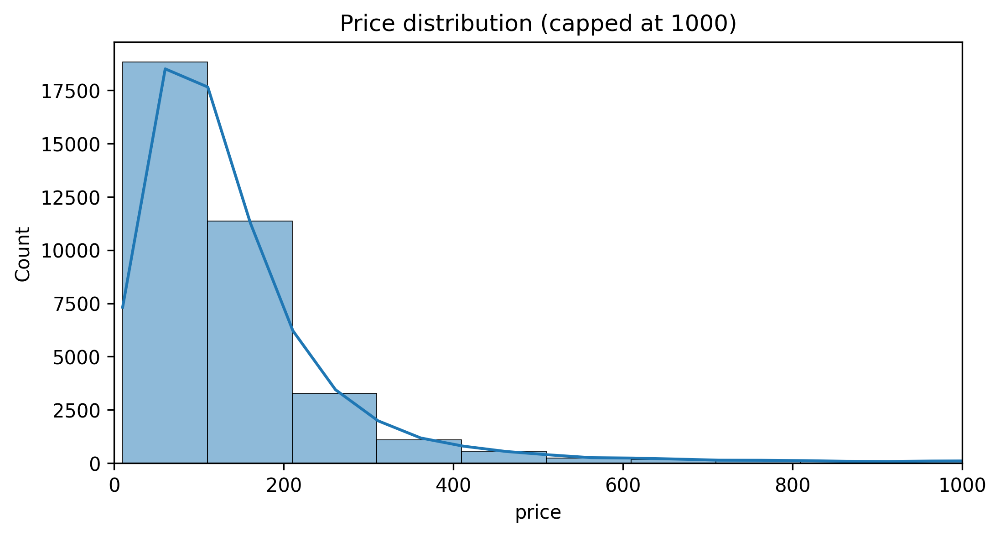
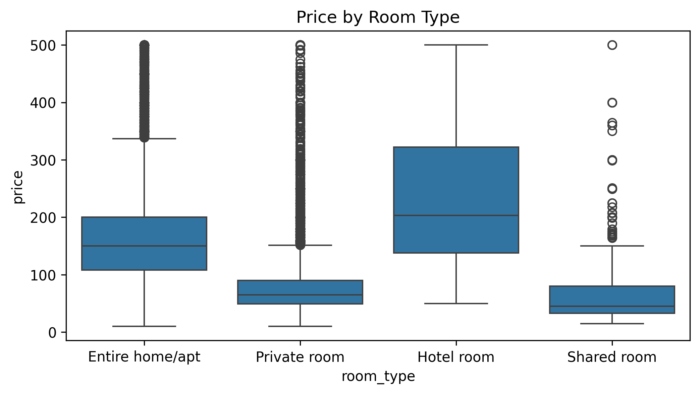
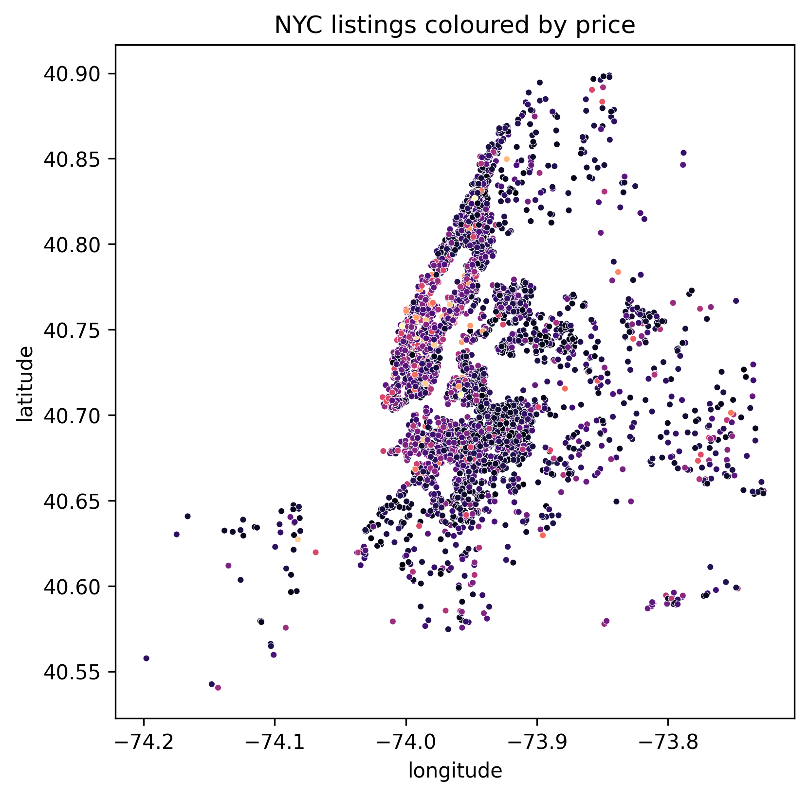
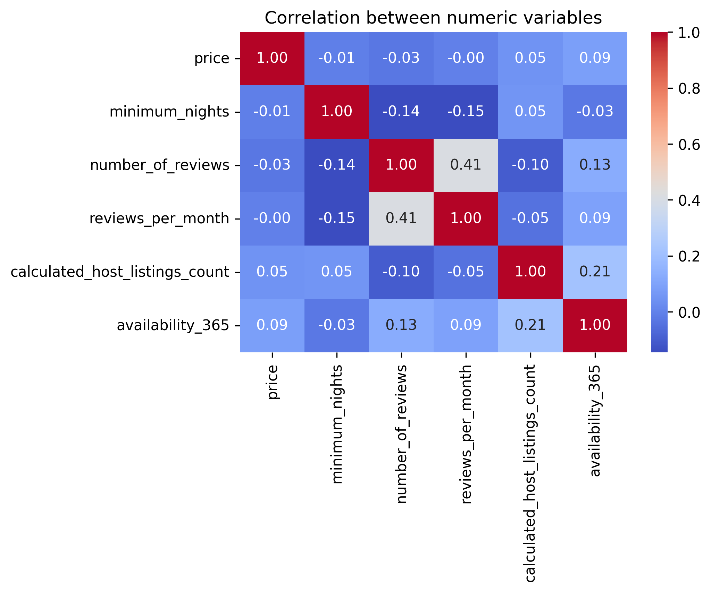

# NYC Airbnb Price Analysis and Prediction

Exploratory Data Analysis (EDA) and machine learning on New York City Airbnb listings to understand pricing drivers and predict nightly prices.

---

## Project overview

This project analyses publicly available Airbnb listings data for New York City to answer three questions:

1. How are Airbnb prices distributed across NYC?  
2. How do room type, location, and booking behaviour influence price?  
3. Can we build a reasonably accurate model to predict nightly price from listing features?  

All work is implemented in Python using pandas, seaborn/matplotlib, and scikit‑learn in a single, reproducible Jupyter notebook (`NYC_Airbnb_EDA_ML.ipynb`).  

---

## Data

- **Source:** Inside Airbnb – New York City listings dataset (`listings.csv`). 
- **Granularity:** One row per Airbnb listing.  
- **Key fields used:**
  - `neighbourhood` – neighbourhood name  
  - `latitude`, `longitude` – geographic coordinates  
  - `room_type` – Entire home/apt, Private room, Shared room, Hotel room  
  - `price` – nightly price (target variable)  
  - `minimum_nights` – minimum stay length  
  - `number_of_reviews`, `reviews_per_month` – demand / review activity  
  - `calculated_host_listings_count` – number of listings for a host  
  - `availability_365` – number of days available in a year 

---

## Repository structure
```
AIRBNB_PROJECT/
├── data/
│ └── listings.csv
│
├── images/
│ ├── histogram.png
│ ├── boxplot.png
│ ├── scatterplot.png
│ └── heatmap.png
│
├── notebooks/
│ └── NYC_Airbnb_EDA_ML.ipynb
│
└── README.md
```

> Plot images can be generated from the notebook using `plt.savefig("images/<name>.png", bbox_inches="tight")`. 

---

## Methodology

### 1. Data cleaning

- Selected relevant columns (location, room type, price, reviews, availability, host activity). 
- Removed listings with non‑positive prices and capped very high prices (e.g., > 500) for EDA to reduce the influence of extreme outliers while keeping a realistic working subset.  
- Filled missing `reviews_per_month` with 0 and converted `last_review` to datetime; dropped residual rows with critical missing values before modelling.

### 2. Exploratory Data Analysis (EDA)

### **Price Distribution**


The price distribution is **right-skewed**, with most listings under \$200–\$300 but a long tail of luxury listings.

---

### **Price by Room Type**


- Entire homes/apartments → highest prices  
- Hotel rooms also expensive  
- Private rooms and shared rooms → budget-friendly  

---

### **Geospatial Price Scatter Plot**


Expensive listings cluster in **Manhattan**, especially near central and tourist areas.

---

### **Correlation Heatmap**


Numeric features show weak direct correlation with price → suggests nonlinear modelling works better.

---


### 3. Feature engineering and modelling

- **Target:** `price`.  
- **Features:** `neighbourhood`, `latitude`, `longitude`, `room_type`, `minimum_nights`, `number_of_reviews`, `reviews_per_month`, `calculated_host_listings_count`, `availability_365`. 
- One‑hot encoded categorical variables (`neighbourhood`, `room_type`) and performed an 80/20 train‑test split.  
- Trained three models:
  - Baseline mean predictor  
  - Linear Regression  
  - Random Forest Regressor 
- Evaluated with Mean Absolute Error (MAE) and Root Mean Squared Error (RMSE). 

---

## Results

### Model performance

| Model             | MAE (USD) | RMSE (USD) | Notes                                 |
|-------------------|-----------|-----------:|---------------------------------------|
| Baseline (mean)   | ~65.7     | ~87.8      | Naive reference                       |
| Linear Regression | ~48.6     | ~69.8      | Clear improvement over baseline       |
| Random Forest     | ~42.7     | ~64.5      | Best performance among tested models  |

Random Forest reduces MAE by roughly 35% relative to the baseline and outperforms Linear Regression on both MAE and RMSE. 

### Feature importance

Random Forest feature importance indicates that:

- `room_type` and precise location (`longitude`, `latitude`) are the strongest predictors of price.  
- Booking and host activity signals (`availability_365`, `reviews_per_month`, `number_of_reviews`, `calculated_host_listings_count`) also contribute meaningfully. 

--- 

## Key insights

- NYC Airbnb prices are highly right‑skewed with a small number of very expensive listings.  
- Entire homes/apartments and hotel rooms are priced far above private and shared rooms. 
- Location has a strong effect on price, with premium clusters visible on the city map. 
- A tree‑based model (Random Forest) offers substantially better predictive accuracy than a naive baseline or simple linear model.
---

## How to run

1. Clone the repository and create a Python environment.  
2. Download `listings.csv` for New York City from Inside Airbnb into the `data/` folder. 
3. Install dependencies (`pandas`, `numpy`, `matplotlib`, `seaborn`, `scikit-learn`).  
4. Open `notebooks/NYC_Airbnb_Price_Prediction.ipynb` and run all cells.

---

## Future work

- Log‑transform price and perform hyperparameter tuning for Random Forest / Gradient Boosting.   
- Add text features from `neighborhood_overview` using basic NLP. 
- Incorporate `calendar.csv` and `reviews.csv` to model seasonality and demand dynamics.